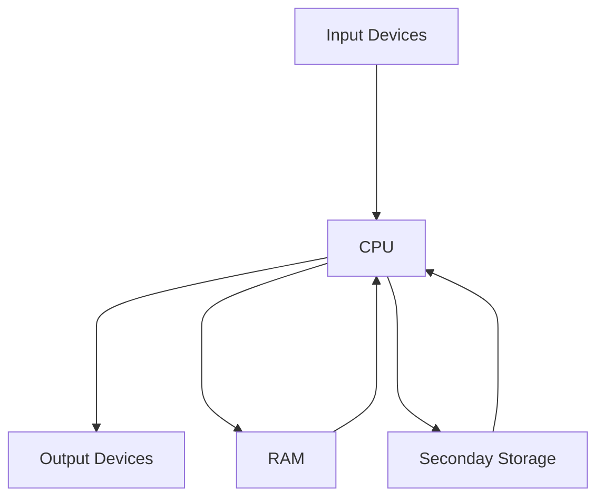

noted : 04/10/22

# 1.6 Storage Devices

## RAM & ROM

|    |RAM |ROM|
|:---|:---|:--|
|Stand for?|Random Access Memmory|Read Only Memory|
|Stored in it?|OS, running programs, data being used|BIOS|
|Volatile?|Yes|No|
|Read/Write|Read & write |Read |

## Tracks, Sectors & Platters
Tracks are created on a magnetic disk.  
Disks spin at high speeds: 7,200rpm  

## Company Server Data
hard disks have high capacity
relatively cheap.