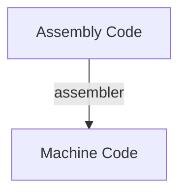
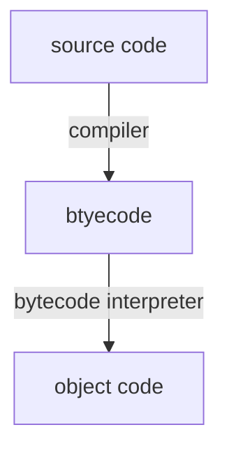

noted : 03/10/22

# Programming language Translators


## Assembly code
Computers execute machine code  
It difficult for humans to:
- read
- write
- debug

Assembly ode instrutions are 1:1 equivelent.

## Translators
### Assembler
Assembly code is a low-level language.



The machine code produced is hardware specific.

### Compiler
Translates a program written in a high level language into executeable machine code going through serveral stages.  
language such as:
- Visual Basic
- C++

```mermaid
graph TD;
    A[Entire program written in a High-level language]--compiler-->B[Machine Code];
``````

The machine code produced is hardware specific.

### Interpreter
Translates a program written in a high level language into executeable machine code.  
Languages such as:
- JavaScript
- PHP

This is NOT done entirely. It is done line by line.

```mermaid
    graph TD;
        A[1 line written in a High-level language]--interpreter-->B[Machine Code];
        B--next line-->A
```

### Compiler vs interpreter

|Comiler |Interpreter |
|:-------|:-----------|
|run many times without needing to recompile| source code can be run on any machine|
|faster to execute |if small error found, does not need to recompile the entire program|
|executeable code does not require an interpreter| |
|compiled code cannot be easily read and copied| |

## Bytecode
Most languages use compilers and interpreters.  
EG:



## Stages of compilation
Stages to convert souce code to object code:

- Lexical Analysis
- Symbol Table
- Syntax Analysis
- Sematic Analysis
- Code Generation

### Lexcial Analysis
1. Unnecessary spaces and comments are removed.
2. Keywords, constants and identifiers are replaced with tokens. Tokens represent functions.

Forexample:
```
age = 17
print(age)
```
This could produce:
```
<identifier> <operator> <number> <keyword>
<open_bracket> <identifier> <close_bracket>
```

#### Symbol Table
The lexer builds up a symbol table for every keyword and identifier in a program.  
The table helps to keep track of hte run time memory address for each identifier.

### Syntax Analysis
The tokens from the lexing stage are split up into phrases.  
Each phrase is parsed. This means it's checked against the syntax.  
If it is not valid, an error will be recorded.

#### Syntac Rules
Synatx rules can be drawn as diagrams.

### Semantic Analysis
Code that follows the syntax but is not a valid program (logic error), is picked up by the semantic analysis.  
For example:  
source code:
```
if a > 5
```
Could look like this:
```
<if> <identifier> <operator> <number>
```
but a is not defined. This error is picked up by the semantic analysis.

### Code Generation
Once the program has been checked, the compiler generates the machine code.  
It may do this in many passes over the code because code optimisation will take place.

#### Code Optimisation
Aims to:
- remove redundant instructions
- replace inefficient coed with code that achieves the same result but in a more efficient way.