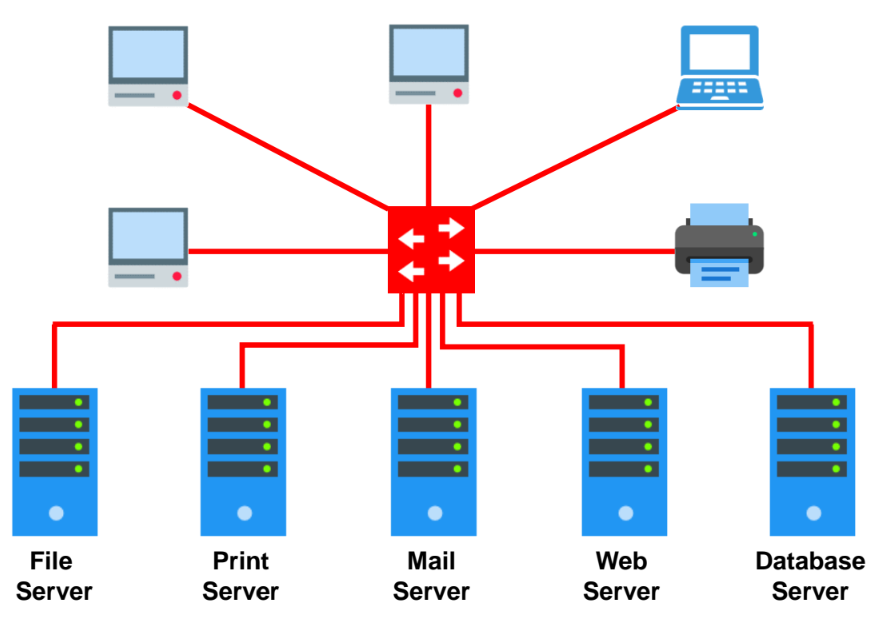
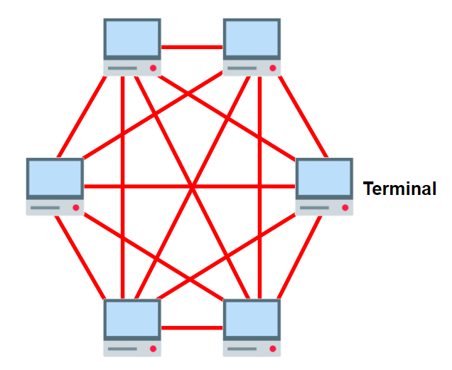

noted : 14/03/23

# Client Server and Peer to Peer

A network model is made of a central server, and client(s).  
Clients access data from the server.

## Client-server VS Peer-to-peer

Client-server models have a central server to manage security, stores files, and process requests. Requests may be for services like email, file storage, and printing.

Peer-to-peer models have no central servers to manage these things. This means that if a computer is turned off, then data can not be retrieved from it.

| Client-server                                                        | Peer-to-peer                                      |
| :------------------------------------------------------------------- | :------------------------------------------------ |
| Centrally controlled user IDs, passwords, and access levels          | Files and programs stored on individual computers |
| Small to large orgs use                                              | small org or home use                             |
| More expensive to set up and maintain as may need specialst IT staff | Cheaper to set up and maintain                    |
| Centralised and automated back-ups                                   | Each PC can act as client or server               |
| No access to other users' files                                      | Used for sharing music and streaing live events   |

## Client-side Processing

Data is processed before it is sent to a server by the lient.  
JS used to validate data before sent to server for further validation

| Advantages                                                                                      | Disadvantages                                                                                                   |
| :---------------------------------------------------------------------------------------------- | :-------------------------------------------------------------------------------------------------------------- |
| Better interactivity by immediate response to the user's action                                 | Not all browsers support all scripts (outdated)                                                                 |
| Faster responses to user's action as no communication with server                               | Execution speed can depend on users' computer's performance                                                     |
| Decreases server load as it removes unnecessary processing on server                            | Web devs can not always predict outcome of a script, as browsers can process scripts in slightly different ways |
| Better security as data can not be intercepted as it is not being sent across network to server |                                                                                                                 |

## Server-side Processing

Server process information like user inputs for validation, display pages, structure web apps, interact with databases.  
Some common server-side languages:

-   PHP
-   Python
-   ASP

A client may not be able to provide the data needed to process a request.  
A company may hold sensetive data relating to the request.  
The way data is proccessed may also be lawfully protected.

A server may also validate data submitted by a client as JS can easily be circumvented.  
This makes server side validation crucial.

| Client Processing  | Server Processing                      |
| :----------------- | :------------------------------------- |
| web page behaviour | Item stock level lookup                |
| Styling            | Loading product info from the database |
| form vaildation    | sending request back to the client     |

## Application Programming Interface

An API is a set of tools that can be used for building software applications

API requests are processed by the client and responded to by the server.  
The following exampe allos a web page to make us of the google maps facility:
``
