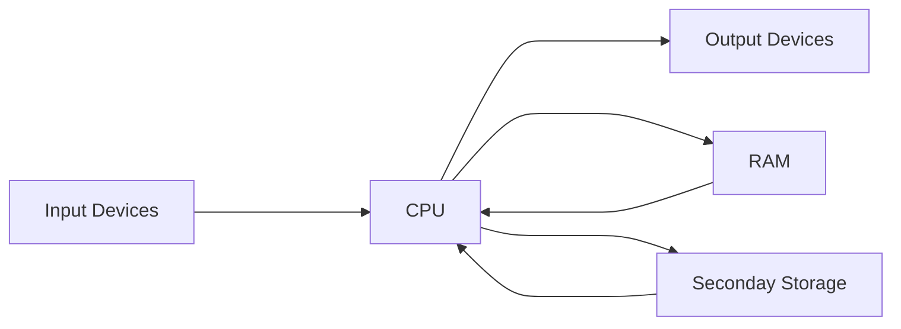

noted : 04/10/22

# 1.6 Storage Devices

## RAM & ROM

|               | RAM                                   | ROM              |
| :------------ | :------------------------------------ | :--------------- |
|Stands for| Random Access Memory                 | Read Only Memory |
| Stores | OS, running programs, data being used | BIOS             |
| Volatile     | Yes                                   | No               |
| Read/Write    | Read & write                          | Read             |

## Tracks, Sectors & Platters

Tracks are created on a magnetic disk. This disk spins at very high speeds (7,200 rpm).
Spinning platters are each read by drive heads.

## Company Server Data

Hard disks have high capacity and are relatively cheap.

| Media            | Capacity     | Access speed |
| :--------------- | :----------- | :----------- |
| Hard Disk        | 0.5-6 TB     | Fast         |
| CD-ROM           | 700 MB       | Medium       |
| DVD              | 5-9 GB       | Medium       |
| BlueRay Disk     | 25-50 GB     | Medium       |
| Solid State Disk | 0.004 - 2 TB | Very Fast    |
