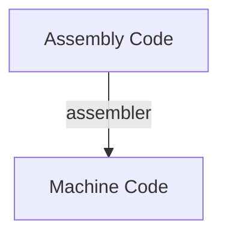
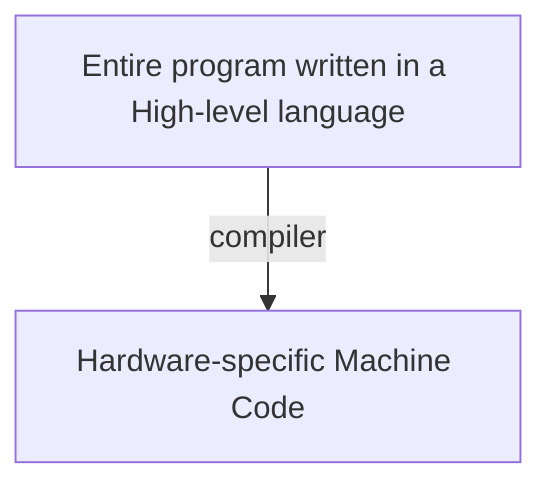
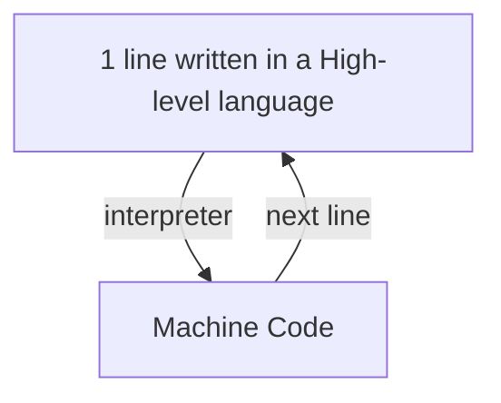
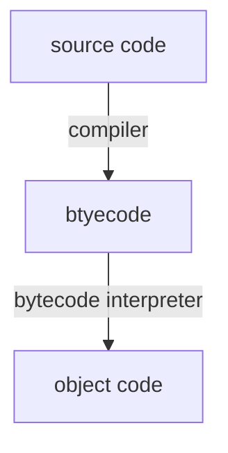

noted : 03/10/22

# Programming language Translators

## Assembly code

Assembly code instructions are 1:1 equivalent to Machine code.  
Computers execute machine code but it difficult for humans to read write and debug.
## Translators

### Assembler

Assembly code is a low-level language.



The machine code produced is hardware specific.

### Compiler

Translates a program written in a high level language into executable machine code, going through several stages.  
Language such as Visual Basic and C++





### Interpreter

Translates a program written in a high level language into executable machine code.  
Languages such as:

-   JavaScript
-   PHP

This is NOT done entirely. It is done line by line.



### Compiler vs interpreter

| Comiler                                          | Interpreter                                                         |
| :----------------------------------------------- | :------------------------------------------------------------------ |
| run many times without needing to recompile      | source code can be run on any machine                               |
| faster to execute                                | if small error found, does not need to recompile the entire program |
| executeable code does not require an interpreter |                                                                     |
| compiled code cannot be easily read and copied   |                                                                     |

## Byte code

Most languages use compilers and interpreters.  
EG:



## Stages of compilation

Stages to convert source code to object code:

-   Lexical Analysis
-   Symbol Table
-   Syntax Analysis
-   Sematic Analysis
-   Code Generation

### Lexical Analysis

1. Unnecessary spaces and comments are removed.
2. Keywords, constants and identifiers are replaced with tokens. Tokens represent functions.

For example:

```
age = 17
print(age)
```

This could produce:

```
<identifier> <operator> <number> <keyword>
<open_bracket> <identifier> <close_bracket>
```

#### Symbol Table

The lexer builds up a symbol table for every keyword and identifier in a program.  
The table helps to keep track of the run time memory address for each identifier.

### Syntax Analysis

The tokens from the lexing stage are split up into phrases.  
Each phrase is parsed. This means it's checked against the syntax.  
If it is not valid, an error will be recorded.

#### Syntax Rules

Syntax rules can be drawn as diagrams.

### Semantic Analysis

Code that follows the syntax but is not a valid program (logic error), is picked up by the semantic analysis.  
For example:  
source code:

```
if a > 5
```

Could look like this:

```
<if> <identifier> <operator> <number>
```

But `a` is not defined. This error is picked up by the semantic analysis.

### Code Generation

Once the program has been checked, the compiler generates the machine code.  
It may do this in many passes over the code because code optimisation will take place.

#### Code Optimisation

Aims to:

-   Remove redundant instructions
-   Replace inefficient code with code that achieves the same result but in a more efficient way.
