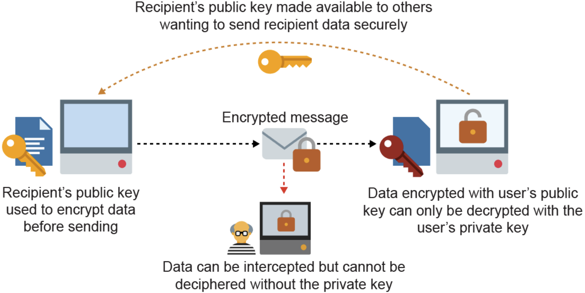

noted : 03/01/23

# Exchanging Data

## Data transfer and storage

Data is constantly moved around computers and networks.  
The transfer is usually faster and more accurate, when the distance from sender to reviver is shorter.

## Reducing data requirements

Reducing data to send or store ensures that:

-   Data sends more quickly.
-   Less bandwidth is used
-   Buffering on AV streams is less likely
-   Less storage required

## Compressing Data

There are 2 types of compression:

| Compression | Definition                                                                                                                     | E.G.                                          | File Format(s) |
| :---------- | :----------------------------------------------------------------------------------------------------------------------------- | :-------------------------------------------- | :------------- |
| Lossy       | Non-essential data is permanently removed                                                                                      | Frequencies of sound that humans can not hear | JPG, MP3       |
| Lossless    | Patterns in data are spotted and "summariesd" in a shorter format. New file created from summarised data without loss of data. | Compressions text files or software code      | MP3            |

### Run Length Encoding

A form of lossless compression.
A compression technique that finds runs of repeated binary patterns and replaces them with a single instance of the pattern, and a number that specifies how many times the pattern is repeated.  
For example:

Q. apply Run Length Encoding on the binary value: fdddddbbbjhkedfddddsdfewwwww  
A. f1d5b3j1h1k1e1d5s1d1f1e1w5

### Dictionary Compression

A form of lossless compression.
Reduces the size of data by storing regularly occuring patterns in a dictionary. This means that, instead of storing the original data as is, it replaces repeating patterns with references to entries in the dictionary.

## Encryption

A way of ensuring that data cannot be understood without a way to understand it.  
When received, the ciphertext is decrypted back to plaintext using the same or different key.  
Two opposites are the Caesar Cipher (lower security) and the Vernam Cipher (higher security).

### Caesar Cipher

Most basic and insecure encryption method. Done by shifting letters of the alphabet by a constant.
Brute Force Attacks are used to decrypt them. This is an attack that attempts to apply every possible key.

### Vernam Cipher

The encryption key (One Time Pad), is the only unbreakable cipher.  
The key must be:

-   A truly random sequence greater or equal in length than the plaintext and only ever used once once.
-   Shared with the recipient by hand, independently of the message, and destroyed immediately after use.

You can decrypt the message bit by bit using; an XOR operation with the shared key.

#### The One Time Pad

The One Time Pad must be truly random. This can be acomplished by:

-   Atmospheric noise
-   Radioactive decay
-   Movements of a mouse
-   Snapshots of a Lava Lamp

### Algorithmic security

Keys are determined by computer algorithm.  
A Key derived from algorithm can also be unpicked.  
Given enough computer time and power, (almost) any key can be determined and the message cracked.

### Symmetric Encryption

The same key is used to encrypt and decrypt data.  
This means that the key must also be transferred to the recipient. It can be intercepted as easily as the message.

### Asymmetric encryption

Uses 2 seperate, but related, keys. One for encrypting (public key), and another for decrypting (private key).
This means that, those wanting to send a message can encrypt it with the public key, but that message can only be decrypted with the one private key.

## Hashing

A hashing function provides mapping between a randomly lenghted input, and a fixed length or smaller output.  
It is one way so you can not get back to the original.  
Commonly used for password encryption. A user's hashed password will be stored in a database. When the user attempts to log in, their password input is hashed and that output is compared to the value stored in the database.
