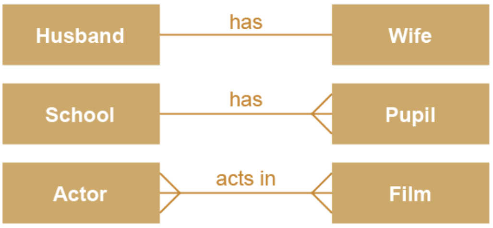

noted : 3/10/23

# Database Concepts

## A Simple Database Structure

The simplest type of database is a flatflie database containing information about a single entity.  
An Entity is a category of a thing of interest about which we will store data.  
In databases, entities are represented by tables - often refered to as relations. These relations are made of rows and columns, representing records/instances and fields/attributes, respecfully.

## Keys

| Term          | Definition                                                                                                                         |
| :------------ | :--------------------------------------------------------------------------------------------------------------------------------- |
| Primary Key   | A field/column, that uniquely identifiers each record in the table                                                                 |
| Composite Key | A type of primary key made of 2 fields, allowing for identification of records based on a combination of multiple fields           |
| Secondary Key | An indexed field or set of fields that imrpoves search performance for specific criteria, allowing for faster retrieval of records |
| Foreign Key   | A foreign key is a field in a table that appears as the primary key in another table                                               |

The primary key is an identifier for each entity in a relational database.  
Composite Keys are made from more than one field. It is like a combination of information to ensure more accurate identification in databases.  
Secondary Keys allow for searches to be made other ways. For example, searching for a customer in a database by their name or email, rather than their customer ID. In this case, the name or email could be the secondary key.

## Relationships & ERDs

Entities are related. They can either be:

-   One-to-one
-   One-to-many
-   Many-to-many

Entity Relationship Diagrams are used to visualise the relationships between entities in a database

Creating a relationship between entities is done by including the Primary Key of entity A, in entity B. This then becomes a foreign key in entity B.
Relationships between entities are made by including the Primary Key of entity A, in entity B. This then becomes a foreign key in entity B.  
A foreign key is an attribute that creates a link between to relations.

## Referential Integrity

This means that no foreign key in a table, can reference a non-existent record in a related table.
