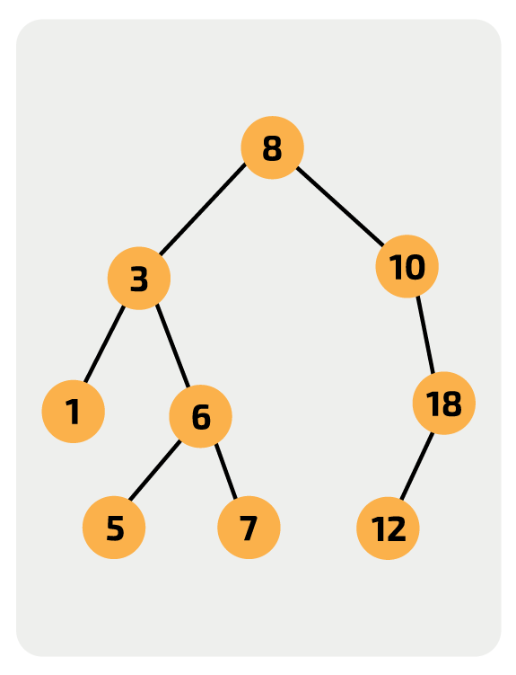

noted : 3/7/23

# Searching Algorithms

## Linear Search

A linear search goes through each item in a list until the item is found or proven not in the list. This means that the list can be ordered or unordered.
The average number of names to examine is n/2.
The worst case scenario would be to look at each card.  
The time complexity is O(n).

| Scenario   | Big-O |                                                                                                                            |
| :--------- | :---- | :------------------------------------------------------------------------------------------------------------------------- |
| Best Case  | O(1)  | If the sought item is the first one searched                                                                               |
| Worst Case | O(n)  | If the sought item is the last one searched, or if it is not found. As then the max num of comparisons will have been made |

General algorithm for a Linear Search:

```
FUNCTION linearSearch(nameList, nameSought):
    index = -1
    i = 0
    found = False
    while i < LEN(namelist) AND NOT found:
        if namelist[i] == nameSought then:
            index = i
            found = True
        endif
        i += 1
    endwhile
    return index
ENDFUNCTION
```

Has time complexity of O(n).

## Binary Search

Searches through a sorted list.
Algorithm for a Binary Search

```python
items = ["ab", "af", "cg", "hi", "jz", "ma", "pe", "sa", "sf", "sm"]
searching_for = "jz"
found = False

# Initialize variables for the first and last indices of the search range
first = 0
last = len(items) - 1

while first <= last and found == False:
    # Calculate the midpoint of the current search range
    midpoint = (first + last) // 2
    if items[midpoint] == searching_for:
        found = True
    else:
        # If the midpoint item is less than the target item, adjust the search range to the right
        if items[midpoint] < searching_for:
            first = midpoint + 1
        # If the midpoint item is greater than the target item, adjust the search range to the left
        else:
            last = midpoint - 1

print(f"Found at index: {items.index(items[midpoint])}")
```

In a list of 2<sup>n</sup> items, the max number of items you would look at is n + 1.  
The time complexities are shown below:

| Scenario     | Big-O     |                                                                                                                            |
| :----------- | :-------- | :------------------------------------------------------------------------------------------------------------------------- |
| Best Case    | O(1)      | If the sought item is the first one searched                                                                               |
| Average Case | O(log(n)) | Expressed as this because: as the constants become less signification as the size of the input grows                       |
| Worst Case   | O(log(n)) | If the sought item is the last one searched, or if it is not found. As then the max num of comparisons will have been made |

## Binary Search Trees

A BST is a tree where the nodes of the tree are ordered.  
If the order is from low to high: then the nodes of the left subroot are less than the node, and the nodes on the right subroot are higher that that of that node.  
This property is true for every node; the nodes of its left subroot will have values that are lower, and the nodes of its right subroot will have values that are higher.

In the following diagram, the root is 8.



Let's search for the number 5:

-   Start at the root: 8
-   5 is less than 8 so we check the left child.
-   5 is greater than 3 so we check the right child.
-   5 is less than 6 so we check the left value.
-   5 is equal to 5 so we've found it

Algorithm for Inorder Traversal of the tree

```
procedure traverse(p)
    if tree[p].left != -1 then
        traverse(tree[p].left)
    endif
    print(tree[p].data)
    if tree[p].right != -1 then
        traverse(tree[p].right)
    endif
endprocedure
```

This is similar to binary search as it does not require you to search all the values. But to be as efficient as a binary search, the tree must be balanced.

### Balanced vs Unbalanced BST

| Tree       | Explain                                                                                             | Efficiency              |
| :--------- | :-------------------------------------------------------------------------------------------------- | :---------------------- |
| Balanced   | Every node at the end of a branch is around the same distance away from the root as any other leaf. | Equal to binary search  |
| Unbalanced | One or more node is much further away from the root than another node.                              | Less than binary search |

Time Complexity for Balanced Tree:

| Scenario   | Big-O     |                                                                                                                            |
| :--------- | :-------- | :------------------------------------------------------------------------------------------------------------------------- |
| Best Case  | O(1)      | If the sought item is the first one searched                                                                               |
| Worst Case | O(log(n)) | If the sought item is the last one searched, or if it is not found. As then the max num of comparisons will have been made |

Time Complexity for Unbalanced Tree:

| Scenario   | Big-O |                                                                                                                            |
| :--------- | :---- | :------------------------------------------------------------------------------------------------------------------------- |
| Best Case  | O(1)  | If the sought item is the first one searched                                                                               |
| Worst Case | O(n)  | If the sought item is the last one searched, or if it is not found. As then the max num of comparisons will have been made |
