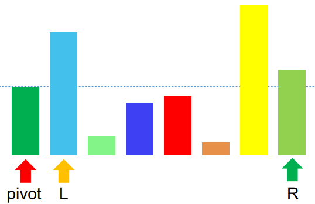
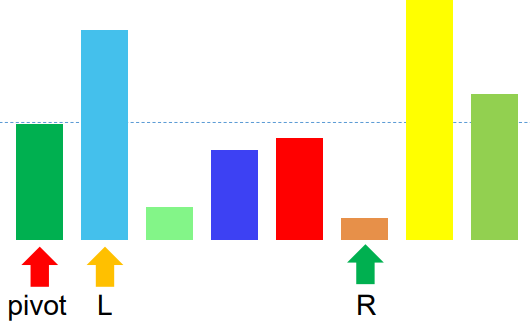
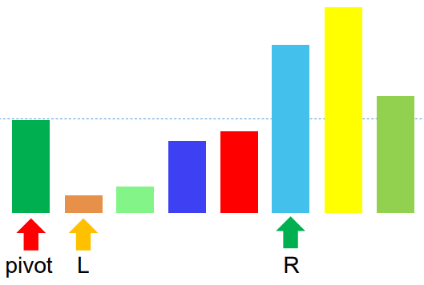
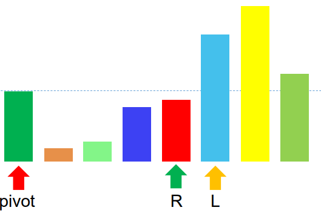
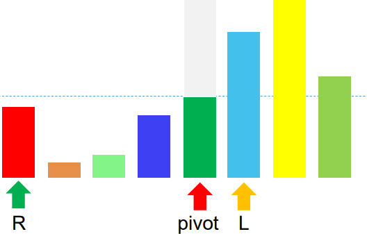
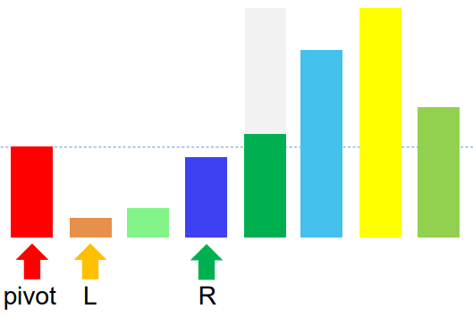

noted : 06/10/23

# Merge & Quick Sort

## Merge Sort

Quicker than bubble sort.  
Split list of items into lists of a singular item. Merge them back in order.  

The time complexity:
O(nlog(n))

## Quick Sort

Quickest.

Visualisation:

- Use L and R pointers to determine the split point where the pivot value begins.
- Starts like this:

---

1. L pointer moves right until it finds an item larger than the pivot.
2. Then the R pointer moves left until it finds an item smaller than thte pivot.

---

3. The two items are then swapped, but the pointers stay in the same index.

---

4. The L pointer then continues to move until it finds an item larger than the pivot value
5. The R pointer then continues to move until it finds an item smaller than the pivot vaue.
- The R pointer has now passed the L pointer. This tells us that the pivot point should be before the L pointer.

---

6. So the R pointer, and pivot pointer, are swapped.

---

- Now all the values to the left of the pivot point are smaller, and all the values to the right are bigger.
- At this point we repeat the previous process for the left partition.
- Pivot is the first value, L is next, and R is the rightmost of this partition.
- Starts like this:

---

7. The L pointer moves right until it finds an item larger than the pivot.
- There is no value larger than the pivot in this left partition. So the L pointer stays where it is.
8. The R pointers moves left until is finds an item smaller than the pivot.
- It is already in position.

---

Worked example:

1. Determine a split point in order to divide the list into 2 halves; 1 half being less than the split point, the other half being larger than.
2. Choose a value to be the pivot value. Normally the first value in the list.
3. Divide the list into two partisions: items < pivot, and all items < pivot
4. Now the pivot is at the correct place.
5. Repeate this process with each new partitioned list.

O(nlog(n))