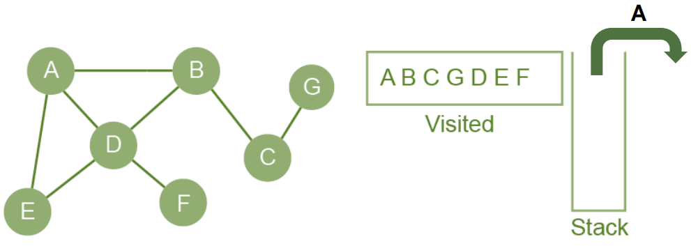

noted : 12/09/23

# Graph Traversal Algorithms

There are 2 ways of traversing a graph:

| Term          | Def                                                                                      |
| :------------ | :--------------------------------------------------------------------------------------- |
| Depth-first   | go as far as you can down a path before backtracking and going down the next path        |
| breadth-first | explore all neighbours of current vertex, then the neighbours of each of those verticies |

## Depth first

Depth first algorithms use a stack to keep track of the last node visited, and a list to hold the names of nodes that have been visited.

Has several applications:

-   Job-scheduling
-   Finding path between 2 verticies
-   Soling pzzels such as navigating a maze

### Walkthrough

Here is the dictionary data structure for the graph:

```
GRAPH = {
    "A": ["B", "D", "E"],
    "B": ["A", "C", "D"],
    "C": ["B", "G"],
    "D": ["A", "B", "E", "F"],
    "E": ["A", "D"],
    "F": ["D"],
    "G": ["C"],
}
```

Each key represents a node. The value pair represents the links. So A is linked to B, D, and E.

---

We start with an empty stack, and list.


---

1. Visit the first node: `A`
2. Then, add `A` to the visited list and mark it as visited on the graph


---

3. Push `A` onto the stack
4. Next, visit the next unvisited neighbour: `B`
5. Then, add `B` to the visited list and mark it as visited on the graph


---

6. Push `B` onto the stack
7. Next, visit the next unvisited neighbour: `C`
8. Then, add `C` to the visited list and mark it as visited on the graph


---

9. Push `C` onto the stack
10. Next, visit the next unvisited neighbour: `G`
11. Then, add `G` to the visited list and mark it as visited on the graph


---

12. From `G`, there are no unvisited nodes so we backtrack to `C`
13. Pop `C` off the stack and return to `C`


---

14. From `C`, there are no unvisited nodes so we backtrack again to `B`
15. Pop `B` off the stack and return to `B`


---

Now that we have backtracked to `B`, there are unvisited neighbouring nodes: `D`

16. Push `B` back onto the stack
17. Next, visit the next unvisited neighbour: `D`
18. Then, add `D` to the visited list and mark it as visited on the graph


---

19. Push `D` onto the stack
20. Next, visit the next unvisited neighbour: `E`
21. Then, add `E` to the visited list and mark it as visited on the graph


---

22. From `E`, there are no unvisited nodes so we backtrack to `D`
23. Pop `D` off the stack and return to `D`


---

Now that we have backtracked to `D`, there are unvisited neighbouring nodes: `F`

24. Push `D` back onto the stack
25. Next, visit the next unvisited neighbour: `F`
26. Then, add `F` to the visited list and mark it as visited on the graph


---

27. At `F`, all neighbouring nodes have been visited, so we pop `D` and backtrack to `B`


---

28. At `D`, all neighbouring nodes have been visited, so we pop `B` and backtrack to `A`


---

28. At `B`, all neighbouring nodes have been visited, so we pop `A`.



### Algorithm For Depth First

```
function dfs(graph, currentVertex, visited)
    append currentVertex to list of visited nodes
    for vertex in graph[currentVertex]
        if vertex not in visited then
            dfs (graph, vertex, visited)
        endif
    next vertex
    return visited
endfunction
```

## Breadth first

Breadth first algorithms use a queue to keep track of nodes that we still have to visit, and a list to hold the names of nodes that have been visited.

Has several applications:

-   Finding the shortest path between two points
-   Web crawling
-   Finding all the friends of a given individual - Facebook

### Walkthrough

1. Append `A` to the queue, and mark it as pale green to show it has been queued.


---

2. Visit `A`, remove it from the queue.
3. Then, amend `A` to the visited list, and mark it as dark green to show it has been visited.


---

4. Amend Each of `A`'s neighboring nodes: `B`, `D`, `E` to the queue, and mark them as pale green.


---

5. Visit `B`, and remove it from the queue.
6. Then, amend `B` to the visited list, and mark it as dark green.


---

7. Amend `B`'s remaining neighbor: `C` to the queue, and mark it as pale green.


---

8. Visit `D`, remove it from the queue.
9. Then, amend `D` to the visited list, and mark it as dark green.


---

10. Amend `D`'s remaining neighbor: `F` to the queue, and mark it as pale green.


---

11. Visit `E`, remove it from the queue.
12. Then, amend `E` to the visited list, and mark it as dark green.


---

13. Visit `C`, remove it from the queue.
14. Then, amend `C` to the visited list, and mark it as dark green.


---

15. Amend `C`'s remaining neighbor: `G` to the queue, and mark it as pale green.


---

16. Visit `F`, remove it from the queue.
17. Then, amend `F` to the visited list, and mark it as dark green.


---

18. Visit `G`, remove it from the queue.
19. Then, amend `G` to the visited list, and mark it as dark green.


