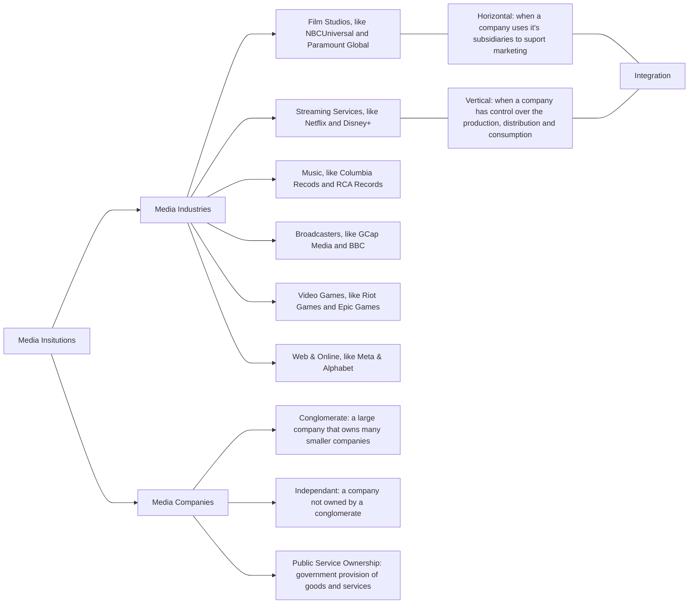

noted : 23/09/22

# Ownership Models of Media Institutions - Consolidation

```mermaid
    graph LR;
	    A[Media Insitutions]--->B[Media Industries];
		B--->C[Film Studios, like NBCUniversal and Paramount Global];
		B--->D[Streaming Services, like Netflix and Disney+];
		B--->E[Music, like Columbia Recods and RCA Records];
		B--->F[Broadcasters, like GCap Media and BBC];
		B--->G[Video Games, like Riot Games and Epic Games];
		B--->H[Web & Online, like Meta & Alphabet];
		C<---I[Horizontal: when a company uses it's subsidiaries to suport marketing];
		D<---J[Vertical: when a company has control over the production, distribution and consumption];
		I<---K[Integration];
		J<---K;
		A--->L[Media Companies];
		L--->M[Conglomerate: a large company that owns many smaller companies];
		L--->N[Independant: a company not owned by a conglomerate];
		L--->O[Public Service Ownership: government provision of goods and services];
```
